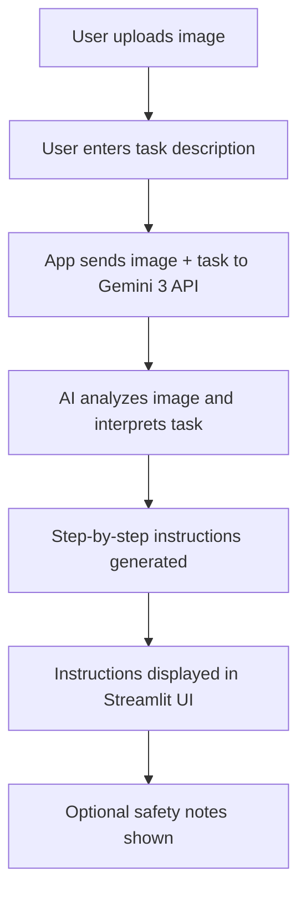

# 🖼️ Visual Instruction Builder - Gemini 3

**Visual Instruction Builder** is an AI-powered web app that allows users to upload an image of any real-world object and receive **step-by-step, beginner-friendly instructions** tailored to their task.

Traditional manuals, online videos, or generic guides often fail to address specific models or scenarios.

This app uses **cutting-edge AI** to analyze images and generate actionable, safe, and clear instructions.

---

## 👉 Try it

Upload an image, describe what you want to do, and get instant step-by-step instructions.

[Open Live Demo](https://image-to-instructions-ai.streamlit.app/)

---

## 🎥 Demo

Watch a short walkthrough of the Visual Instruction Builder:

👉 [Demo Video](https://youtu.be/nCubeThfFwU)

---

## 🚀 Project Overview

Many people struggle when using unfamiliar objects, gadgets, or tools because:

- Manuals are overly technical or missing
- Tutorials may not match the exact model
- Safety warnings are often hidden

**Visual Instruction Builder solves this problem by:**

- Analyzing uploaded images to identify the object
- Understanding the user’s task via prompt input
- Generating numbered, easy-to-follow instructions
- Providing safety notes when relevant
- Supporting beginners with simple language

This demonstrates the power of AI to empower users to interact confidently with everyday objects.

---

## 🎯 Vision

To become a universal tool for learning **“how to use anything”** , supporting:

- Appliances, electronics, and tools
- Hobbyist and educational scenarios
- Personalized AI-generated instructions
- Future multi-platform deployments, including **mobile apps**

---

## 🛠️ Tech Stack

- **Frontend:** Streamlit (Python) 💻
- **Backend / AI:** Google Gemini 3 API 🤖
- **Image Processing:** Pillow (PIL) 🖼️
- **Environment Management:** Python venv, dotenv 🐍
- **Version Control:** Git & GitHub 🗃️
- **Deployment:** Streamlit Cloud ☁️

---

## 🤖 Gemini Integration

This project uses Google's **Gemini multimodal models** to analyze images and generate instructions.

- **Gemini 3.0 Pro** – advanced reasoning and image understanding
- **Gemini 2.5 Pro** – stable, fast alternative

---

## 🔒 v1 Scope (Locked)

**Included in v1:**

- Image upload (jpg/png)
- AI-based object analysis
- User task prompt input
- Step-by-step instruction generation
- Safety warnings
- Optional logging of tokens used
- Public image URL support 🔍

**Excluded in v1:**

- Real-time video instructions
- Multi-language support
- Offline usage
- Paid API alternatives beyond Gemini 3

---

## 🧭 v2 Roadmap (Planned)

- Exportable instructions (PDF/Markdown)📄
- Multi-language support 🌐
- Mobile-friendly UI📱

---

## ✅ Milestones Checklist

**Phase 1 – Foundation**

- Project vision defined 🧭
- Repository initialized 📂
- Streamlit scaffold created 🖥️
- Gemini API integration tested ⚡

**Phase 2 – Core MVP**

- Image upload functionality 🖼️
- Task input handling ✏️
- Step-by-step instruction generation 📜
- Safety warnings integrated ⚠️
- Tokens logging implemented 🔢

**Phase 3 – Public Deployment**

- Streamlit Cloud deployment ☁️
- Environment secrets configured 🔑
- User interface refined 🎨
- Stable public release 🚀

**Phase 4 – Future Enhancements**

- Mobile-friendly UI 📱
- AR step visualization 🕶️
- Multi-language support 🌐
- Exportable instruction formats 📄

---

## 💻 Setup & Usage

### Local Setup

```bash
Local Setup
# Clone the repository
git clone <https://github.com/abq2904/visual-instruction-builder-gemini3.git>
cd visual-instruction-builder-gemini3

# Set up Python environment
python -m venv venv
pip install -r requirements.txt

# Set Gemini API Key (Windows)
setx GEMINI_API_KEY "YOUR_API_KEY"

# Launch the app
streamlit run app.py
```

### Streamlit Cloud Deployment

1. Push your repository to GitHub
2. Go to [Streamlit Cloud](https://streamlit.io/cloud) and **Create New App**
3. Connect your GitHub repo and branch
4. Add **Secrets** : `GEMINI_API_KEY=YOUR_API_KEY`
5. Deploy and access your live demo

---

## 🏗️ Workflow



This flow diagram shows the **entire process** from image upload to instruction display. One can quickly visualize how the app works.

---

## 🧑‍💻 Build Philosophy

- **User-first:** Clear instructions, beginner-friendly
- **Modular:** Easy to extend features and AI models
- **Safe:** Includes warnings when relevant
- **Professional:** Clean code, proper logging, and versioning
- **Deploy-ready:** Minimal, functional, and visually demonstrable

---

## 🔍 Technologies

visual instruction AI, step-by-step guide generator, image-based instructions, beginner guides, object usage AI, Gemini 3, Streamlit app, safe instructions, educational AI tool, AI productivity assistant
